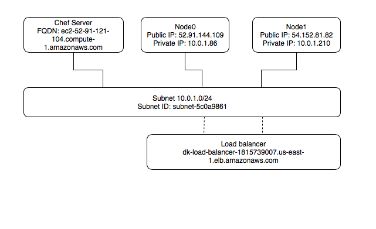
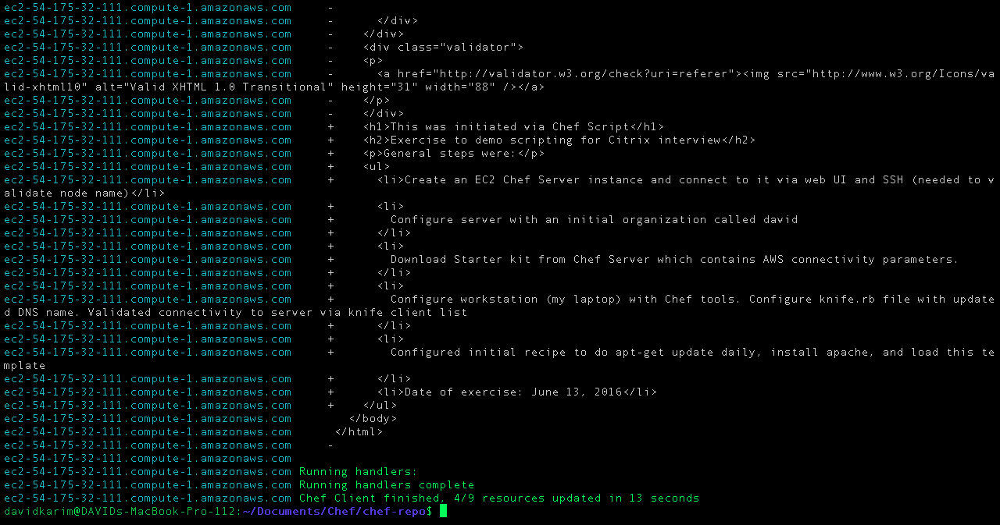
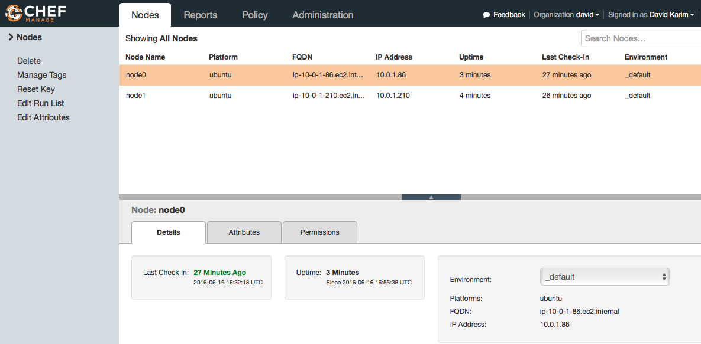
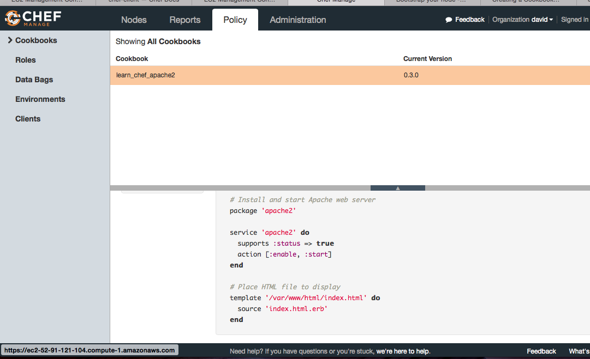
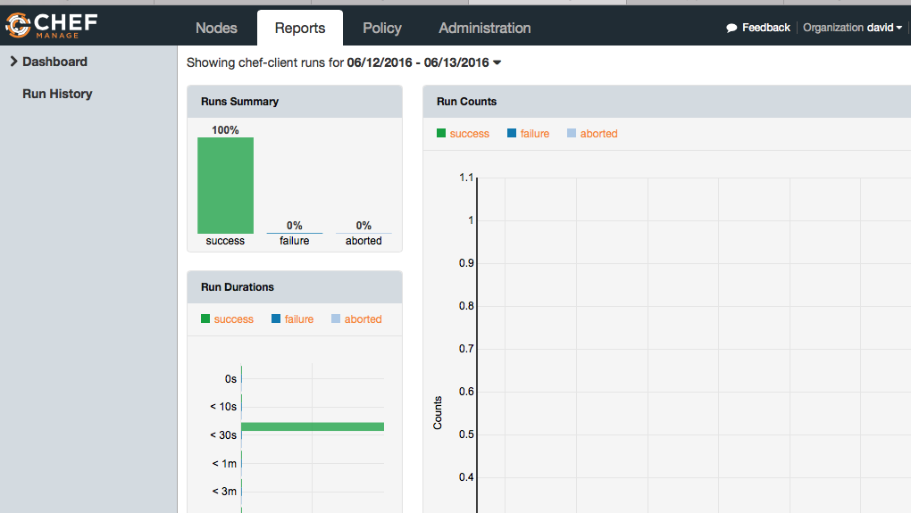

Chef-Repo Exercise on AWS
===============
This is an exercise to demo Chef scripting abilities. The list of requirements before starting:

* Development environment with Ruby, AWS CLI tools, Chef SDK
* AWS account with properly configured IAM settings (AWS Marketplace_full_access role), publicly accessible VPC, and EC2 policies.
* Chef Server AMI license obtained via AWS Marketplace

In summary, the steps were:

* Create an EC2 Chef Server instance and connect to it via web UI and SSH (needed to validate node name of server)
* Configure server with an initial organization called david
* Download Starter kit from Chef Server which contains AWS connectivity parameters for workstation.
* Configure workstation (my laptop) with Chef tools. Configure knife.rb file with updated DNS name. Validated connectivity to server via knife client list
* Configured initial recipe to do apt-get update daily, install apache, and loaded HTML template
* Upload recipe to Chef server
* HTML template is an erb file (embedded Ruby syntax) located [here](cookbooks/learn_chef_apache2/templates/default/index.html.erb)
* See recipe [here](cookbooks/learn_chef_apache2/recipes/default.rb)
* For phase 2, created an AWS launch script to launch infrastructure via AWS SDK; located [here](aws/launch_script.sh)
* Script result was redirected to [this file](aws/response.txt)
* Phase 1 of exercise (Chef server and script): June 13, 2016
* Phase 2 of exercise (Full automation with bash script and AWS CLI): June 16, 2016

The infrastructure that was deployed with this exercise was made live, and then taken down to cut AWS costs.

Note: when visiting the link above (link taken down), you'll be connected to the elastic load balancer. Reloading the page will show node-specific attributes for each server, thus validating load balancer is distributing load across the two servers.

Infrastructure design diagram showing the infrastructure that was created:

Tail end of results of `knife bootstrap` command I ran initially. This command is now part of AWS script:

Screen grab from Chef Server showing that nodes have been bootstrapped. I configured two nodes on the script; they are Ubuntu EC2 instances separate from Chef Server instance:

Screen grab of Chef Server showing that the recipe has been configured and uploaded to the Chef server:

Screen grab showing successful recipe deployments:

