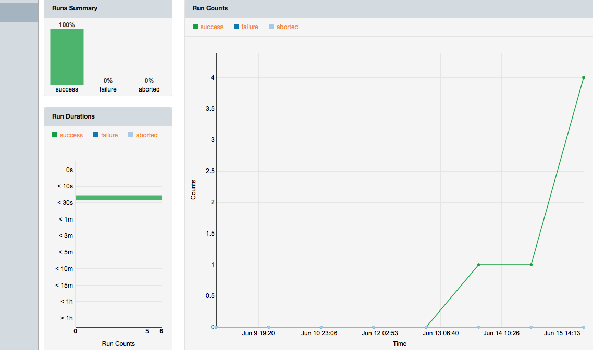

Chef-Repo Exercise on AWS
===============
This is an exercise to demo Chef scripting for my interview. In summary, the steps were:

* Create an EC2 Chef Server instance and connect to it via web UI and SSH (needed to validate node name)
* Configure server with an initial organization called david
* Download Starter kit from Chef Server which contains AWS connectivity parameters.
* Configure workstation (my laptop) with Chef tools. Configure knife.rb file with updated DNS name. Validated connectivity to server via knife client list
* Configured initial recipe to do apt-get update daily, install apache, and load this template
* Date of exercise: June 13, 2016

Tail end of results of `knife bootstrap` command:

Screen grab from Chef Server showing that node has been bootstrapped; this node is an Ubuntu EC2 instance separate from Chef Server instance:

Screen grab of Chef Server showing that the recipe has been configured and uploaded to the Chef server:

Screen grab showing successful recipe deployment:

